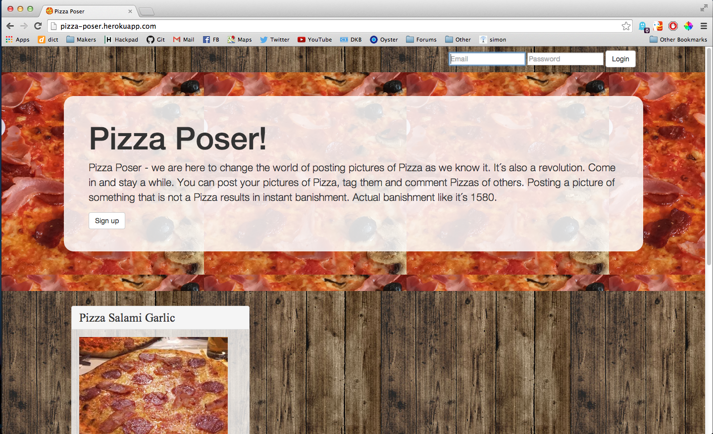

[](https://travis-ci.org/NicoSa/Pizza-Poser)
Instagram-Clone
----
We´re creating an Instagram clone based on Ruby on Rails in Week 9 at Makers Academy London.

Objectives of exercise
----
Practicing setting up a new app in a Ruby on Rails environment including everything from User, Admin-functions to a payment and mailing system.

What still needs to be done
----
- Polishing frontend
- Putting some views in modals

Heroku
----
[Pizza Poser on Heroku]
Technologies used
----
- Ruby
- Ruby on Rails
- Postgresql
- Rspec
- Capybara
- [Devise]
- [Paperclip]
- Amazon Web Services
- Bootstrap
- Git 
- Heroku
- Sendgrid
- Actionmailer
- Stripe
- Websockets
- Devise
- jBuilder
- Javascript
- AJAX

How to run it
----
```sh
git clone git@github.com:NicoSa/Instagram-Clone.git
cd Instagram-Clone
mailcatcher
bin/rails s
```
open your browser and go to localhost:3000

How to test it
----
```sh
cd Instagram-Clone
rspec
```

Pairing Partners
----
[Sroop],[Will]


[Will]:https://github.com/willhall88
[Sroop]:https://github.com/sroop
[Devise]:https://github.com/plataformatec/devise
[Paperclip]:https://github.com/thoughtbot/paperclip
[Pizza Poser on Heroku]:http://pizza-poser.herokuapp.com/
